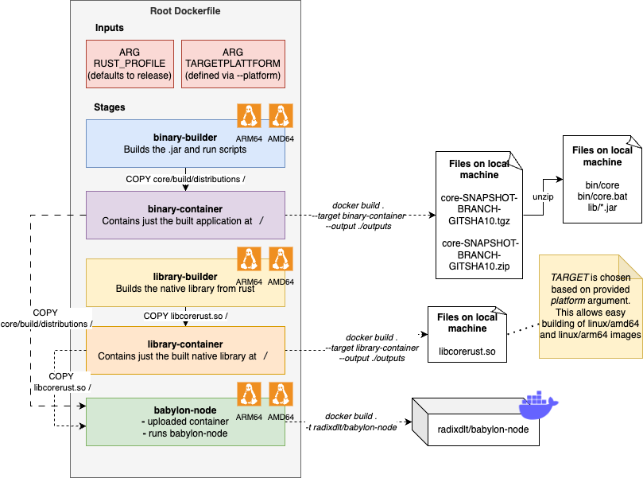

# Running local Radix networks with docker

## Setup

Install `docker` version 20.10+ and `docker-compose` version 1.25+

## Running a network

From the repository root, run the following - replacing 2 with the number of validators you wish to run (1 - 5).

```shell
./docker/scripts/rundocker.sh 2
```

This script requires [`../core-rust`](../core-rust) to be compiled.

## The Dockerfile




The application can be build using a single Dockerfile:

```
docker build . -t radixdlt/babylon-node 
```

If local testing is required, the artifacts can be produced locally with docker aswell by specifying the build target and outputting the result. 

The different targets are:
- `java-build-stage` - the container that builds the java application. Target this to debug any errors during the build process of the java application
- `java-container` - an empty container with only the java build artifacts.
- `library-build-stage` - the container that builds the rust native library. Target this to debug any errors during the build process of the rust application/library
- `library-container` - an empty container with only the built rust native library. This is a library necessary for the application to run.
- `app-container` - (default) a container that runs the babylon-node application with all dependencies installed. Configuration still needs to be added by the user. See `docker/network-size-1.yml` for an example configuration.

Example `core-rust/libcorerust.so`:

```
docker build  . \
    -t radixdlt/babylon-node:local-test-core-rust \
    --target library-container \
    --output ./outputs
ls outputs 
libcorerust.so
```

Example `core/java-binary/*.jar`

```
docker build  . \
    -t radixdlt/babylon-node:local-test-core \
    --target binary-container \
    --output ./outputs
ls outputs 
core-SNAPSHOT-<BRANCH>-<GITSHA10>.tgz 
core-SNAPSHOT-<BRANCH>-<GITSHA10>.zip
```

## Debugging, profiling, etc.

[VisualVM](https://visualvm.github.io/) is your friend.

The `JMX` ports are exposed to ports `9010-90xx` on the docker host. Use `docker ps` to find the specific JMX port you want to connect VisualVM to.
(The JMX host is thus `localhost`).


Heapdumps don't work from VisualVM currently - the alternate is to use jmap, for example:

```shell
$ docker exec docker_explorer_1 jmap -dump:live,format=b,file=/tmp/radixdlt.hprof 1
$ docker cp docker_explorer_1:/tmp/radixdlt.hprof .
```
