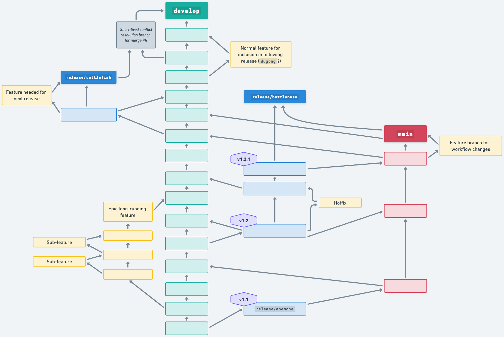

# Branching Strategy

Once you have read the [contributing guide](../CONTRIBUTING.md), if you want to start development, you will need to know which branches to use.

> ![NOTE]
>
> As of 2024-02-12, the strictly ordered list of supported base branches, starting from furthest upstream, is:
> 
> * `release/anemone` - This is currently running on mainnet.
> * `main`
> * `develop`
> 
> When clicking merge on a PR to one of these branches, it is your duty to ensure that PRs are raised to merge that branch into all downstream supported base branches.

## Summary of approach

### The base branches

We use a variant of `git-flow`, where there are three types of base branches: the `main`, `develop`, and `release/*` branches.

* The `main` branch is the public-facing base branch and **represents the last official release**. It's also used for docs.
* The `develop` branch is the primary integration branch, for work targeting the next protocol version.
* The `release/*` branches are for all named protocol versions (i.e. each 1.X in the naming scheme. Typically patch releases should re-use same branch). A subset of release branches are **currently supported** - typically these are those currently on a live environment, or under development.

At any given time, there is a strict ordering on the supported base branches, where the process aims to guarantee all work on previous branches is in the downstream branches. This order (from most upstream to most downstream) is as follows:

* Released `release/*` branches still compatibile with a mainnet network
* `main`
* Unreleased `release/*` branches
* `develop`

The latest ordering is at the top of this document.

### Development process

When working on changes:
* You will first need to select the correct base branch to create your feature branch from. For some epics, it is acceptable to choose a long running `feature/*` or `epic/*` branch as your base, to break up the work into separate reviews.
* Your branch should start `feature/*`, or variants on naming such as `hotfix/*`, `tweak/*`, `docs/*` are permitted. The specific name should be prefixed by a JIRA ticket or Github issue reference where appropriate, e.g. `feature/NODE-123-my-feature` for JIRA tickets or `feature/gh-1235-my-feature` for github issues.
* When you raise a PR, you will need to ensure you select the appropriate base branch before creating the PR. **The default, `main` is typically not correct!**

> [!IMPORTANT]
> 
> Finally, when a PR is merged, it is **the PR merger's responsibility** to ensure that the _base branch_ that was merged into is then merged into _all downstream base branches_ (ideally one by one, like a waterfall).
>
> If there is a merge conflict, this should be handled by creating a special `conflict/X-into-Y-DATE` branch (for branches `X`, `Y` and `DATE`) from `X`, and putting in a PR with a merge target of `Y`.
>
> But if this process is properly followed, such merge conflicts will be rare. 

## Which base branch should I use for X?

### Code changes

Features branches usually branch from `develop`, unless they need to target the current/previous protocol version, in which case, they will need to target the appropriate `release/*` branch.

### Doc changes

Docs changes should use a base branch of `main`.

### Workflow / CI changes

Should branch from the _most downstream_ (earliest) supported branch. Typically this is a `release/*` branch.

Once the post-merge process is followed, this change will find itself on all downstream base branches too.

This ensures that these changes are on all supported branches, so builds can be built on `develop` or on all supported branches.

## Merge or Rebase?

This strategy relies on the fact that we always merge.

We avoid rebases after publicly pushing a branch / seeking a review because:

* Rebases cause potential conflicts with other people's work on the same branches, overwrite the history of the project and overwrite any GPG signed commits from other developers
* Rebases result in more merge conflicts
* Various other benefits discussed in the below section.

We acknowledge the weakness of merging that this can make the git history messier to display.

At merge time, it is acceptable but not recommended to squash-merge. We encourage developers to instead squash commits before asking for a review. This results in a better record of the review / iteration process.

## Diagram

The following demonstrates a possible branch structure under this strategy, under the hypothetical scenario where `barnacle` is the current live protocol version, and `crayfish` is being prepared but not yet live.

Admittedly, this isn't particularly easy to follow. The key with this strategy is following the rules. If the rules are followed, you don't need to visualize the structure.

## Why do we follow this model?

In order to support a network built upon deterministic execution of the radix engine, we need to have a very clear policy of what is compatible with what. This is where the protocol version strategy comes in. And this maps to git via the `release/*` branch strategy.

The rest of the strategy is motivated by the following benefits:
* We only have a single PR to review changes on
* We avoid clashes where conflicting PRs are merged into develop and main at the same time (this used to keep happening, particularly with devops workflow changes, and was a pain to resolve)
* We only have one commit for a given change in the commit tree.
* It makes it trivial to avoid regressions due to forgetting to merge branches - because we can simply check that all base branches X before Y are entirely merged into Y when a release is prepared.

